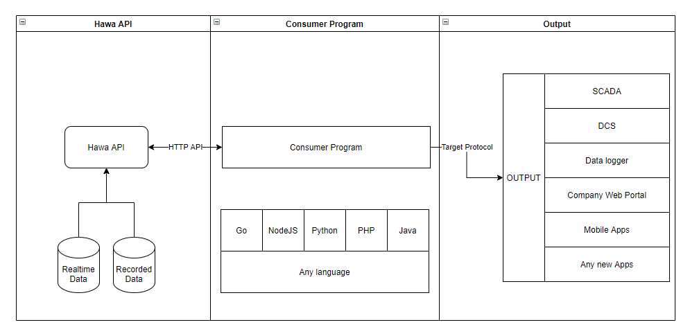
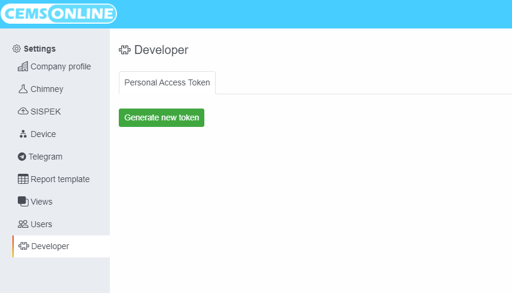
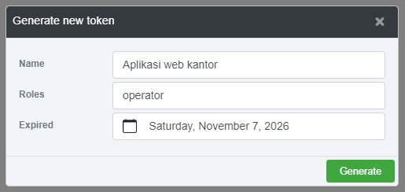
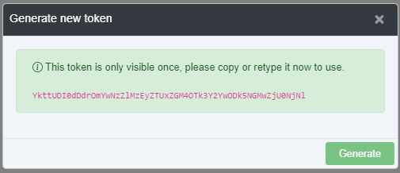
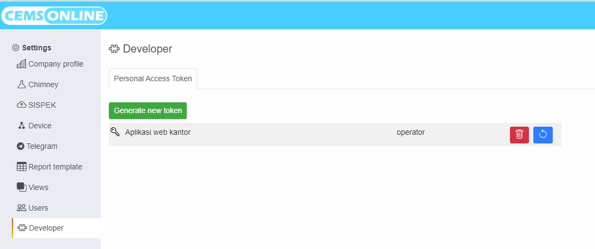

# Memulai dengan Hawa Web API

Hawa Web API adalah web API yang tersedia pada Hawa untuk memudahkan interaksi dengan sistem atau aplikasi lain. Protokol yang digunakan adalah HTTP dan format datanya berupa JSON.

## Istilah-istilah

Sebelum membahas lebih lanjut tentang Hawa Web API, perhatikan terlebih dahulu istilah-istilah yang akan digunakan pada pembahasan selanjutnya.

| Istilah  | Deskripsi |
| -------- | --------- |
| URL      |           |
| Path     |           |
| Method   |           |
| Header   |           |
| Request  |           |
| Response |           |
| Token    |           |

## Metode Otentikasi

Transaksi API pada Hawa menggunakan jenis otentikasi API Key. API Key ini berisi sebuah token yang dibuat langsung pada aplikasi Hawa yang akan diakses.

Pada transaksi HTTP, token dimasukan ke dalam header dengan nama `x-api-key`.

## Membuat Token

1. Buka aplikasi Hawa.
2. Login dengan user admin.
3. Buka menu setting > developer
   
4. Klik tombol `Generate new token`, maka akan muncul dialog seperti berikut:
   
5. Isi dialog sesuai dengan yang diharapkan, kemudian klik `generate`.
6. Jika proses generate token berhasil, maka token akan ditampilkan seperti:
     
   :::tip
   Segera copy token tersebut, karena token ini hanya akan ditampilkan sekali itu saja, jika anda lupa anda hanya bisa membuat ulang token dan token yang sebelumnya tidak bisa digunakan.
   :::

Daftar token yang pernah anda buat dan masih ada akan ditampilkan dalam daftar `Personal Access Token` seperti berikut:

Anda dapat menghapus ataupun membuat ulang token yang pernah anda buat pada daftar tersebut.
