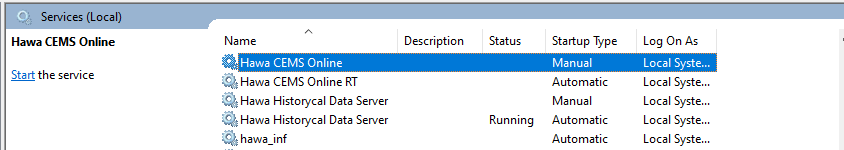
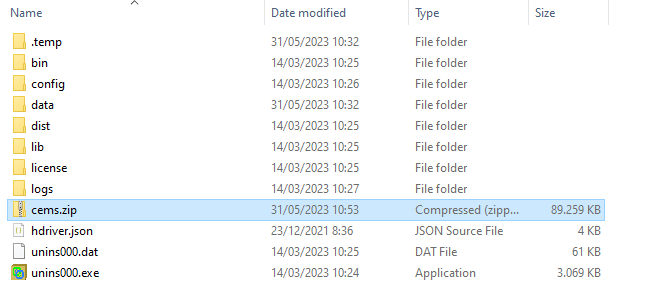

# Quick Start

## Pengertian backup data 

- Backup data adalah proses pembuatan salinan data yang ada untuk tujuan keamanan dan pemulihan. Dalam proses backup, data yang ada di sistem utama disalin dan disimpan di tempat lain, seperti media penyimpanan eksternal, server jarak jauh, atau cloud storage. Backup dilakukan secara teratur dan berkala, tergantung pada kebutuhan dan tingkat kritisitas data yang ingin dilindungi.
  
  Tujuan utama dari backup data adalah untuk melindungi data dari kerusakan, kehilangan, atau serangan malware. Dengan membuat salinan cadangan data, jika terjadi kegagalan perangkat keras, kesalahan manusia, serangan virus, atau kehilangan data lainnya, Anda dapat menggunakan salinan cadangan tersebut untuk memulihkan data yang hilang atau rusak.

## Backup data hawa

- Langkah awal untuk melakukan backup data hawa 

  Buka service pada laptop, kemudian stop service hawa cems 

- Buka folder file hawa diinstall 

  Pada langkah ini, anda bisa melakukan zip semua folder yang ada seperti gambar dibawah ini

  jika sudah selesai maka anda akan mendapatkan file zip dan untuk keamanan backup data hawa sudah selesai dan jangan lupa untuk start running service hawa cems kembali supaya aplikasi hawa cems dapat berjalan seperti semula.

Terima kasih dan semoga dapat membantu anda.