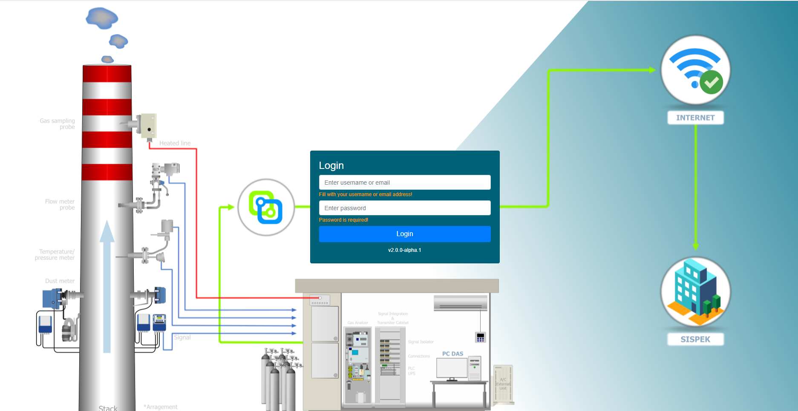
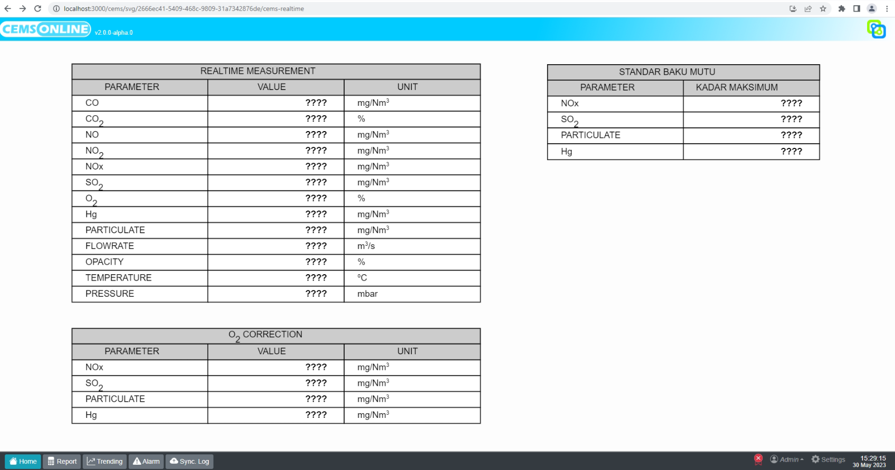

# Getting Started

## Installasi Hawa

<!-- ## 1.1 Persiapan -->

- Buat folder baru dengan nama "Hawa"

- Kemudian install aplikasi ke folder baru tersebut

- Setelah selesai menginstall, maka akan generate file - file seperti dibawah ini

- Buka service  pada laptop, lalu start service Hawa Cems

- Buka browser dan ketikan "localhost:3000", maka akan tampil halaman utama dari aplikasi Hawa Cems 
 login : 
 Username : admin
 Password : admin123

- Setelah berhasil login maka akan tampil halaman utama yaitu Dashboard

<!-- ## Setup Aplikasi Hawa  -->

- Generate license 

- Setelah selesai dengan mendapatkan license aplikasi Hawa siap untuk digukan.
lakukan setup untuk aplikasi Hawa supaya bisa digunakan dengan baik sesuai kebutuhan untuk monitoring sistem.