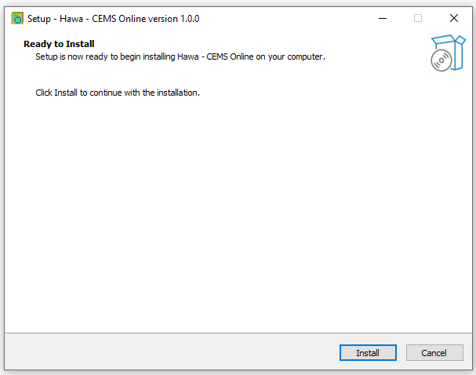
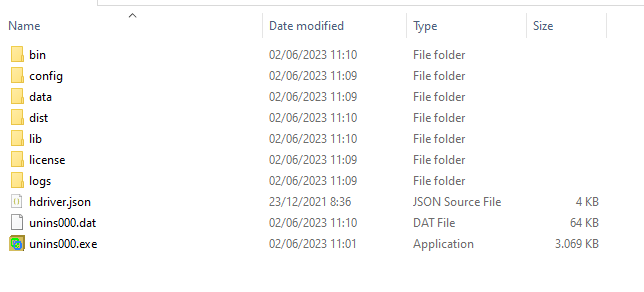
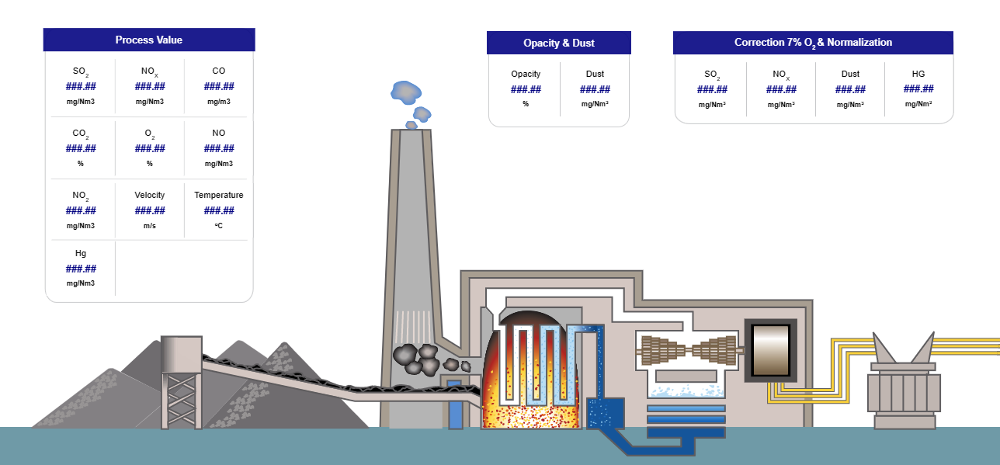
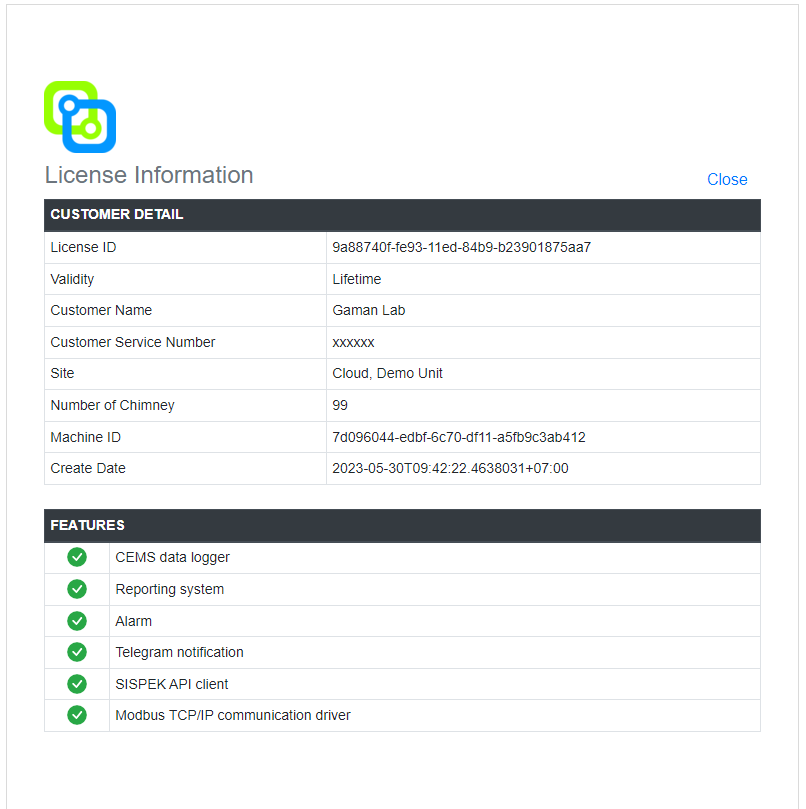

# Getting Started

## Installasi Hawa Cems

 Pada saat ingin melakukan installasi langkah yang benar ketika installasi harap perhatikan panduan yang ada supaya tidak terjadi kesalahan ataupun error pada saat installasi.

Langkah awal untuk memulai installasi, siapkan file installer Hawa.Cems.Online.exe

  
Kemudian pilih install seperti gambar dibawah ini

Lalu tentukan lokasi file Hawa akan disimpan, sebagai contoh seperti gambar dibawah ini

Patikan kembali lokasi file yang akan disimpan sudah benar dan jika sudah maka bisa untuk pilih install jika masih ada kesalahan dalam lokasi file maka silahkan pilih back.

Tunggu sampai proses installasi selesai, jika sudah maka pilih finish

Setelah proses installasi selesai, maka akan generate file - file seperti dibawah ini

Buka service  pada laptop, lalu start service Hawa Cems

Buka browser dan ketikan "localhost:3000", maka akan tampil halaman utama dari aplikasi Hawa Cems 
  Kemudian lakukan login sistem.

Setelah berhasil login maka akan tampil halaman utama yaitu Dashboard

Generate license 

Setelah selesai dengan mendapatkan license aplikasi Hawa siap untuk digukan.
lakukan setup untuk aplikasi Hawa supaya bisa digunakan dengan baik sesuai kebutuhan untuk monitoring sistem.git 