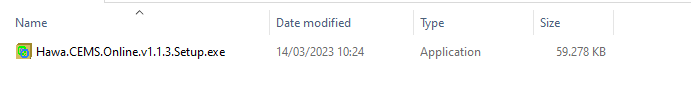
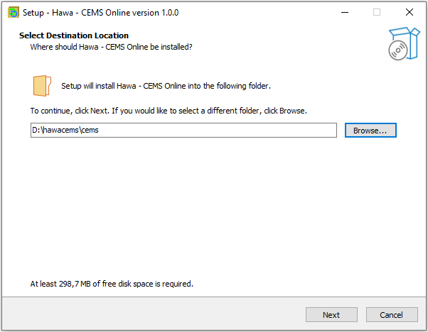
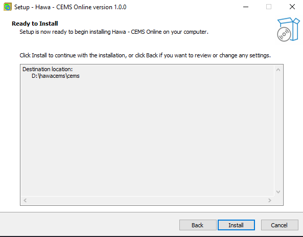
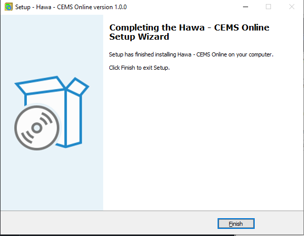
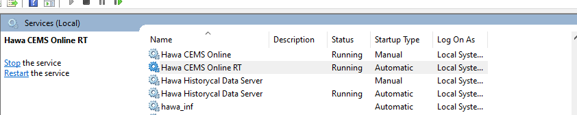
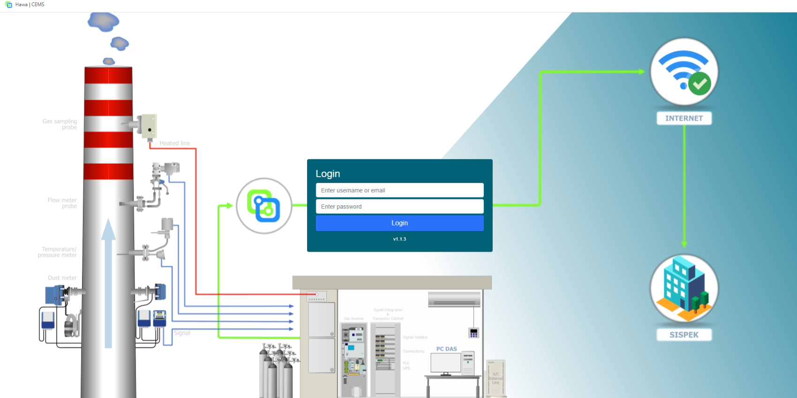

# Petunjuk Pemasangan Hawa CEMS Online

## Persyaratan Sistem

Hawa CEMS Online merupakan aplikasi yang cukup ringan, setidaknya begitu kesan beberapa pengguna yang sebelumnya sudah menggunakan aplikasi DIS lainnya kemudian mencoba menggunakan Hawa dan akhirnya memutuskan untuk seterusnya menggunakan Hawa. Tetapi walaupun "cukup ringan", kami tetap menyarankan setidaknya Hawa diinstall pada komputer dengan spesifikasi minimal seperti berikut:

1. Prosesor Intel core i7 generasi ke 8 atau lebih baru, dan akan lebih baik jika diinstall pada komputer dengan prosesor Intel® Xeon®
2. RAM minimum yang digunakan sebaiknya adalah 8GB
3. Kapasitan penyimpanan minimum 500GB dan akan lebih baik jika menggunakan SSD.
4. Memiliki 2 port LAN (LAN card), 1 port untuk menyambungkan ke jaringan sumber data dan 1 lagi untuk menyambungkan ke internet.
5. Menggunakan monitor dengan resolusi FHD (1920X1080 px)
6. Sistem operasi Windows 10 Profesional 64bit atau lebih baru. Jika anda ingin menggunakan sistem operasi berbasis unix sangat memungkinkan, tetapi sebaiknya dikonsultasikan terlebih dahulu dengan vendor yang menjembatani anda dengan tim internal Hawa agar mendapatkan support yang maksimal.
7. Microsoft office 2019 atau lebih baru. Ini digunakan untuk keperluan fitur report dan pengelolaan data internal perusahaan pengguna Hawa.

Populasi komputer yang cukup banyak digunakan untuk menjalankan Hawa diantaranya adalah:
1. DELL T40
2. DELL T30

> Note: Informasi merk komputer dan tipe ini sama sekali tidak ada unsur iklan atau promosi, ini murni hanya memberikan referensi kepada pengguna lain atau calon pengguna baru dengan harapan mempermudah penentuan spesifikasi teknis sehingga tidak harus mengeluarkan biaya yang sebenarnya melebihi kebutuhan. Jika anda menggunakan merk dan tipe lain, tetapi anda merasa puas dengan performanya, anda bisa menginformasikan merk dan tipe komputer tersebut kepada kami agar kami tambahkan pada daftar di atas atau langsung [menambahkan sendiri](https://github.com/cems-online/docs/edit/main/docs/panduan-installasi/index.md) pada dokumen ini.

## Persiapan pemasangan

Setelah mengetahui sistem yang dibutuhkan, sebelum memulai pemasangan aplikasi Hawa anda perlu menyiapkan beberapa hal, diantaranya adalah:

1. Komputer yang akan digunakan untuk menjalankan aplikasi Hawa CEMS Online.
2. File installer Hawa CEMS Online.
   
   
3. Listrik yang stabil, ini akan mendukung lancarnya proses pemasangan.
4. Sambungan internet yang stabil.
5. Kopi dan snack :-)

## Proses pemasangan

Setelah semua siap, lakukan proses pemasangan dengan langkah-langkah sebagai berikut:

1. Copy file intaller kedalam komputer yang akan dipasangi Hawa.
2. Jalankan file installer Hawa CEMS Online dengan cara klik 2 kali atau klik kanan kemudian Run as Administrator.
3. Jika ada dialog **User Account Control** yang membutuhkan konfirmasi bahwa anda mengijinkan intaller Hawa CEMS Online melakukan perubahan pada komputer anda, klik pada tombol **YES**.
4. Setelah intaller jalan anda akan diminta menentukan lokasi dimana aplikasi Hawa akan diinstall, sebaiknya pilih partisi yang tidak digunakan bersamaan dengan partisi sistem operasi, ini akan membantu menyelamatkan data jika dimasa mendatang perlu dilakukan install ulang sistem operasi atau ada pembaruan sistem operasi.

5. Setelah anda menentukan lokasi pemasangan Hawa, klik pada tombol next, dan intaller Hawa akan mengonfirmasi kepada anda tentang lokasi tersebut.

6. Jika anda sudah yakin dengan lokasi pemasangan Hawa tersebut, klik pada tombol install, kemudian tunggu proses pemasangan sampai selesai yang ditandai dengan tampilan seperti berikut:

8. Setelah pemasangan selesai, klik pada tombol Finish.

## Mencoba Hawa

Langkah berikutnya adalah mencoba mengakses Hawa untuk memastikan bahwa proses pemasangan telah berhasil dan Hawa berjalan dengan baik pada komputer anda.
1. Pastikan service **Hawa RT** dan **Hawa Historycal Data Server** statusnya sudah *Running* dengan cara tekan tombol **Window+R** pada keyboard secara bersamaan, kemudian ketik `services.msc` kemudian klik OK. Pada jendela services, cari service dengan nama **Hawa RT** dan **Hawa Historycal Data Server**, jika statusnya belum *Running* anda bisa menjalankannya secara manual dengan klik pada tombol start, atau klik kanan > start.

2. Setelah servicenya berjalan, coba akses Hawa melalui browser seperti Google Chrome atau Mozilla Firefox atau Microsoft Edge. Buka tautan: [http://localhost:300](http://localhost:3000). Jika muncul formulir untuk login, itu berarti Hawa sudah berjalan.

3. Selamat, anda telah berhasil memasang Hawa. Cukup sederhana bukan?

## Langkah berikutnya

*Hawa sudah terpasang, lalu apa yang harus saya lakukan agar bisa mengirimkan data CEMS saya tampil di aplikasi SIMPEL?* begitulah kira-kira pertanyaan yang cukup sering muncul.

Sebelum Hawa bisa mengirimkan data pengukuran dari peralatan CEMS anda, ada beberapa tahapan yang perlu dilakukan, diantaranya:

1. Menambahkan file lisensi ke dalam komputer anda.
2. Menambahkan dan mengonfigurasi device yang akan menjadi sumber data Hawa.
3. Menambahkan cerobong pada Hawa.
4. Menambahkan parameter pengukuran dan memastikan bahwa pembacaannya telah sesuai.
5. Menambahkan parameter normalisasi dan koreksi oksigen agar sesuai dengan standar yang telah ditetapkan dalam peraturan KLHK.
6. Membuat algoritma untuk menandakan kondisi sumber emisi sedang dalam kondisi beroperasi normal, tidak beroperasi, kalibrasi atau rusak.
7. Mendapatkan App_id dan App_Secret dari KLHK.
8. Memasukan App_id dan App_Secret pada Hawa.
9. Menentukan jadwal pengiriman data dan data apa saja yang harus dikirimkan.
10. Mendapatkan persetujuan dari KLHK untuk mengirimkan data secara kontinyu ke SISPEK.
11. Menunggu proses sinkronisasi dari sistem SISPEK dengan sistem SIMPEL.

