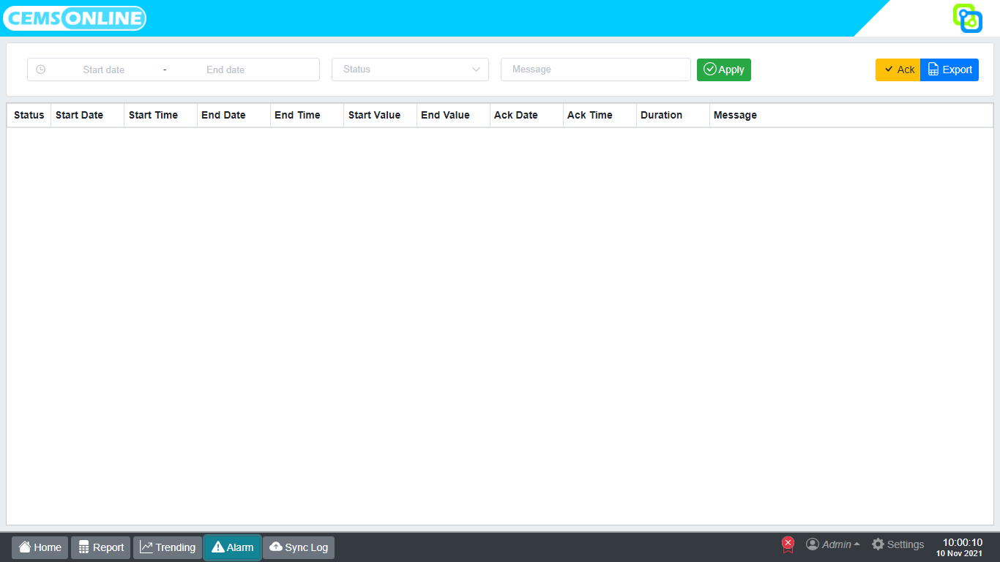

# 4. Alarm

Fitur alarm pada Hawa berfungsi menampilkan alarm secara realtime dan history dari alarm. Alarm akan muncul apabila data telah melebihi nilai bakumutu ataupun nilai limit yang telah ditetapkan.  

## 4.1 Menampilkan Alarm

Untuk menampilkan alarm kita bisa membuka menu `Alarm` dengan cara klik tombol alarm pada menu navigasi.

Setelah tombol alarm di klik, Hawa akan menampilkan halaman seperti berikut :

Pada tampilan alarm terdapat toolbar, diantaranya adalah:

| Menu          | Deskripsi                                                                                                                                       |
| ------------- | ----------------------------------------------------------------------------------------------------------------------------------------------- |
| Time range          | Menentukan rentang waktu history alarm yang ingin ditampilkan (Start date – End date). |
| Status              |  Tombol ini digunakan untuk memilih status alarm yang ingin ditampilkan. Terdapat 3 status alarm. `Active`, status alarm coming (C). `Inactive`, status alarm on going (G). `Acknowledge`, status alarm yang telah diack (A).       |
| Message       |  Tombol ini berfungsi untuk memfilter message yang akan ditampilkan pada alarm.                    |
| Apply         | Klik tombol ini untuk menerapkan filter dan menampilkan alarm. |
| Ack           | Tombol ini digunakan untuk mematikan notifikasi alarm seperti tampilan kedap kedip pada alarm. |
| Export        |  Tombol ini digunakan untuk menyimpan alarm dalam format file excel.                  |