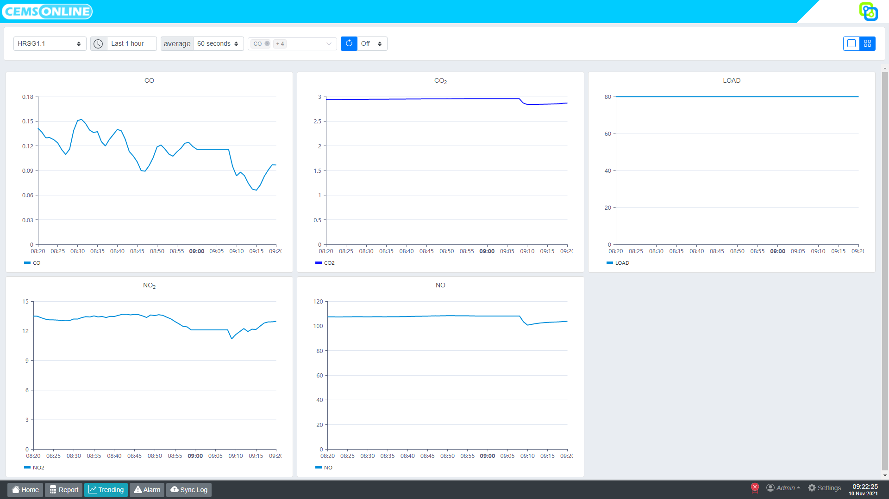
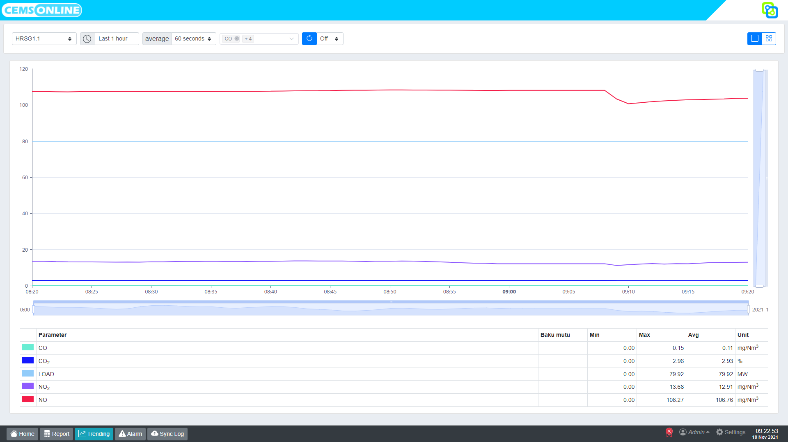

# 3. Trending

Fitur trending pada Hawa berfungsi untuk menampilkan grafik nilai pengukuran parameter tertentu pada suatu cerobong yang dibandingkan dengan waktu pengukuran.
Sumbu Y menampilkan nilai pengukuran, sedangkan sumbu X menunjukan waktu pengukuran.

Kita bisa mengakses menu trending dengan cara klik tombol `Trending` pada menu navigasi.

## 3.1 Menampilkan Trending

Beberapa hal yang perlu di perhatikan dalam menampilkan trending adalah sebagai berikut :

1. Memilih cerobong yang akan ditampilkan trendingnya dengan klik tombol pada ujung kiri.
2. Menentukan rentang waktu trending yang ingin ditampilkan pada tombol jam (From-To).
3. Menentukan rata-rata tampilan pada tombol `Average`.
4. Memilih parameter yang ingin ditampilkan pada tombol `Select parameters`.
5. Klik `tombol refresh` untuk menampilkan trending.
6. Menentukan jenis tampilan trending dengan klik tombol pada sebelah kanan. 

Terdapat 2 (dua) jenis tampilan trending, yaitu : 
- Trending dengan tampilan grafik per parameter. Klik `tombol satu kotak` pada sebelah kanan maka akan muncul tampilan seperti berikut :

- Trending dengan tampilan dari beberapa parameter sesuai dengan filter dalam satu grafik. Klik `tombol empat kotak` pada sebelah kanan maka akan muncul tampilan seperti berikut : 

