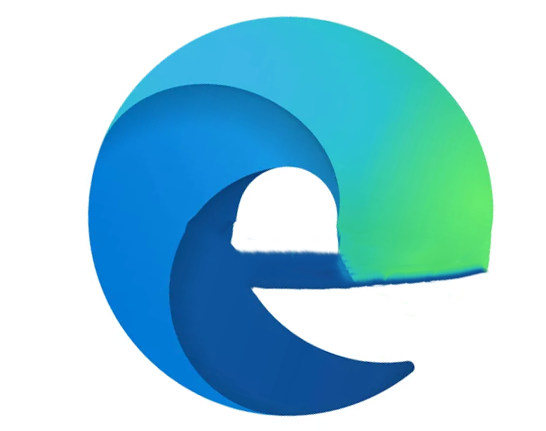
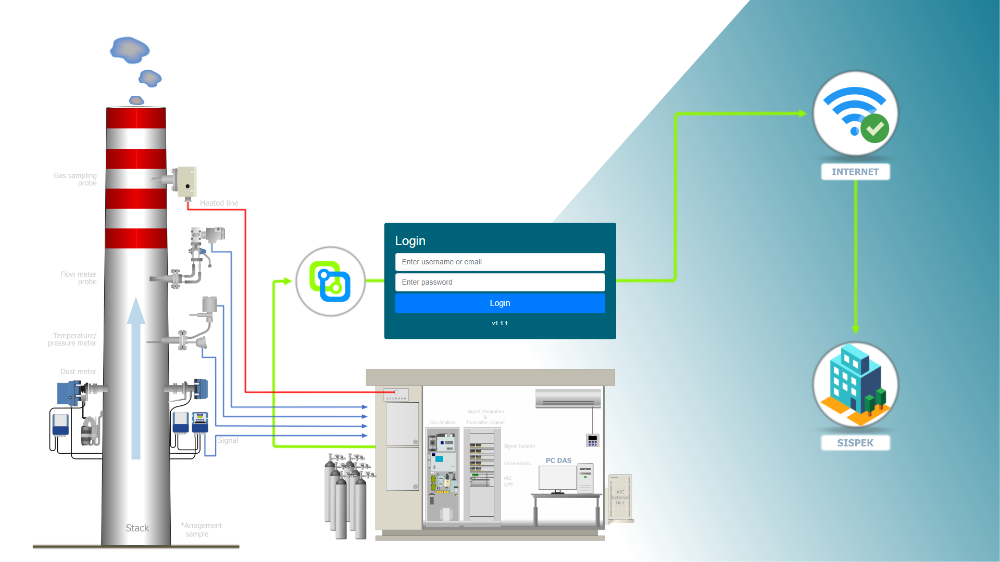

# 1. Mengakses hawa

## 1.1 Persiapan

Untuk mulai menggunakan atau mengakses CEMS Online, kita memerlukan web browser yang mendukung aplikasi web SPA (Single Page Application).

Beberapa web browser yang biasa digunakan diantaranya adalah:

- Google chrome 
- Mozilla Firefox 
- Microsoft Edge 

Jika anda belum memiliki salah satu browser yang disebutkan diatas, kita bisa mengunduhnya pada alamat:

- [Google chrome](https://www.google.com/intl/id/chrome/)
- [Mozilla firefox](https://www.mozilla.org/id/firefox/new/)
- [Microsoft edge](https://www.microsoft.com/id-id/edge)

## 1.2 Membuka hawa

Hawa CEMS online merupakan aplikasi berbasis web yang bisa diakses menggunakan alamat web atau URL (Uniform Resource Locator). Pengaturan standar aplikasi cems online menggunakan port 3000.

Sehingga jika kita ingin membuka pada komputer dimana aplikasi hawa diinstall, kita bisa mengetikkan alamat [`http://localhost:3000`](http://localhost:3000) atau [`http://127.0.0.1:3000`](http://127.0.0.1:3000).

Jika kita akan mengakses hawa yang berada pada komputer lain, kita bisa mengaksesnya dengan menggunakan alamat IP komputer tersebut. Berikut ini adalah ilustrasi untuk akses hawa dari remote komputer/laptop yang terhubung ke hub yang sama atau dalam 1 segmen jaringan:

Jika kondisi sambungannya seperti yang digambarkan di atas, maka kita bisa mengakses hawa dengan menggunakan alamat [`http://192.168.100.114:3000`](http://192.168.100.114:3000). Tetapi sebelum kita bisa mengakses alamat tersebut, kita harus memastikan bahwa pada firewall, port yang digunakan oleh hawa sudah diberikan akses.

## 1.3 Login

::: danger PERINGATAN
Untuk menjaga keamanan, mohon segera mengganti username dan password, dan anda juga harus mengingat username dan password yang baru.
:::

Jika berhasil, tampilan pertama kali yang terbuka adalah halaman login seperti berikut:

Agar kita bisa mengakses fitur-fitur yang tersedia di hawa, kita harus memiliki akun hawa terlebih dahulu.
Jika belum ada perubahan, secara standar hawa memiliki 2 akun, yaitu akun admin dan operator.
| Username | Password | Roles |
|:-|:-|:-|
|admin | admin123 | Administrators |
|operator | operator | Operator|

Jika berhasil login, maka akan diarahkan ke halaman utama yang mungkin berbeda untuk setiap site.

<!-- ## 1.4 Mengganti password

## 1.5 Menambahkan pengguna -->
