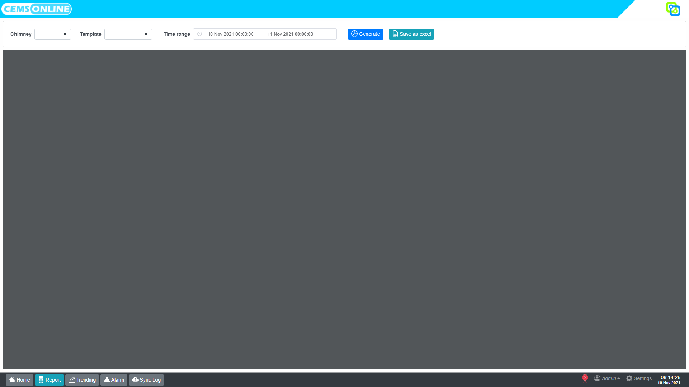

# 2. Laporan

Pada Hawa, laporan berarti rekapitulasi dari pengukuran parameter pada cerobong tertentu dengan rentang waktu yang ditentukan.

## 2.1 Membuat laporan

Untuk membuat laporan kita bisa membuka menu `Report` dengan cara klik tombol report pada menu navigasi.

Setelah tombol report di klik, Hawa akan menampilkan layar seperti berikut:

Pada tampilan report terdapat toolbar, diantaranya adalah:

| Menu          | Deskripsi                                                                                                                                       |
| ------------- | ----------------------------------------------------------------------------------------------------------------------------------------------- |
| Chimney       | Untuk memilih cerobong yang akan dibuatkan rekap pengukurannya                                                                                  |
| Template      | Template laporan yang akan digunakan. Template ini dapat disesuaikan dengan kebutuhan.                                                          |
| Time range    | Memilih rentang waktu pengukuran. Semakin lama rentang waktu yang dipilih akan semakin lama juga waktu yang dibutuhkan untuk membuat laporannya |
| Generate      | Tombol ini digunakan untuk membuat laporan dan menampilkannya di dalam report viewer yang terletak di bawah toolbar                             |
| Save as excel | Tombol ini digunakan untuk mengunduh laporan dalam format file excel                                                                            |

::: warning CATATAN
Tombol `Generate` hanya akan berfungsi jika pada komputer yang terinstall Hawa terdapat software Microsoft Office 2019 atau setelahnya.
:::

## 2.2 Membuat template laporan

Untuk mempermudah pemenuhan kebutuhan rekapitulasi data pengukuran, Hawa memiliki fitur untuk membuat atau modifikasi template.
Format laporan dibuat dalam file excel, dan data yang akan diinput ke dalam file excel tersebut dikonfigurasi di Hawa.

Menu membuat template terdapat pada menu [`Settings > Report template`](/setting/report). Pengguna yang diijinkan untuk membuka menu ini hanya pengguna yang memiliki role admin.
