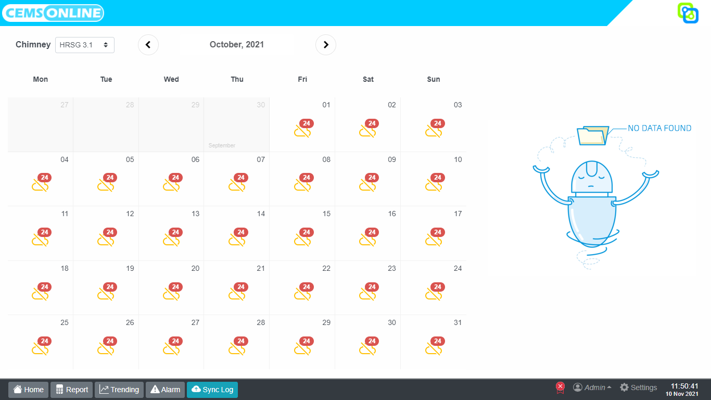

# 5. Melihat riwayat sinkronisasi

Fitur `Sync log` menampilkan riwayat dari sinkronisasi CEMS dengan server. Pada menu ini, kita bisa melacak status pengiriman data ke server sehingga jika terjadi kesalahan atau kegagalan bisa kita ketahui waktu dan penyebabnya.

Pada tampilan `sync log` terdapat toolbar, diantaranya adalah:
1. `Server` merupakan sistem yang menerima dan mengelola data hasil pemantauan emisi dari CEMS.
2. `Chimney` untuk memilih cerobong dari data pengukuran yang dikirimkan ke server.
3. Memilih waktu yang akan ditampilkan riwayat sinkronisasinya dengan klik tombol bulan di sebelah kanan tombol chimney.

Informasi yang dapat kita peroleh dari riwayat sinkronisasi diantaranya adalah : 
1. `Measurement time` menunjukkan waktu pengukuran emisi.
2. `Message / Respons` menunjukan status pengiriman. Jika sinkronisasi berhasil maka akan muncul pesan `succes`. Pesan `failed` jika sinkronisasi gagal disertai dengan keterangan penyebab kegagalan sinkronisasi.

## Riwayat sinkronisasi dengan SISPEK

Menampilkan riwayat sinkronisasi yang dikirimkan ke SISPEK

## Riwayat sinkronisasi dengan SIPLAH
