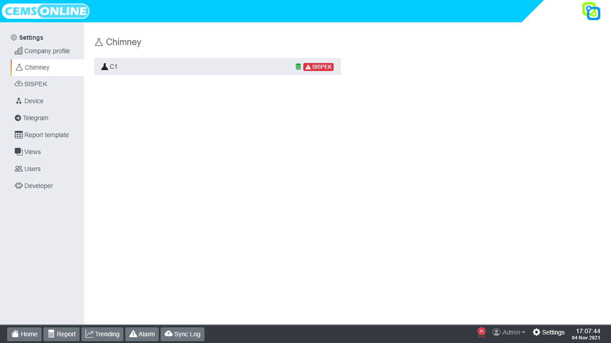
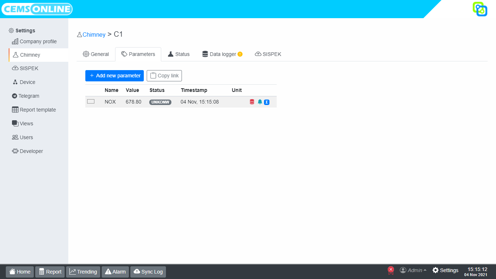
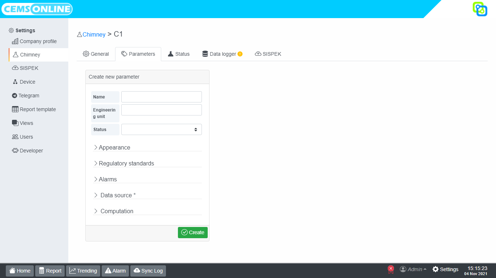

# Parameter

### Menambahkan parameter

1. Pada Hawa, buka menu `settings > Chimney`, maka akan muncul tampilan seperti berikut :

2. Pilih chimney yang akan disetting /diatur parameternya.
3. Klik _Add new parameter_ pada tampilan berikut untuk menambahkan parameter.

4. Isikan data pada masing-masing kolom yang tersedia.

::: warning Create New Parameter
* _Name_, nama parameter.\
`> Tidak boleh sembarangan mengubah nama parameter karena akan berpengaruh pada Historical Trend.`
* _Engineering Unit_, satuan yang digunakan untuk setiap parameter.
* _Status_, status dari chimney untuk setiap parameter.
:::

::: tip Appearance
* Color, pemilihan warna parameter untuk tampilan grafik pada historical trend.
* HTML name
* HTML engineering unit, penulisan satuan parameter.
* Decimal precision, jumlah digit di belakang koma dari nilai pembacaan parameter.
* Minimum
* Maximum\
Minimum dan maximum merupakan nilai y yang akan muncul pada historical trend
:::

::: warning Regulary Standards

Kolom untuk memasukkan standar nilai bakumutu untuk setiap parameter.
* Enabled, jika diaktifkan maka otomatis akan muncul alarm apabila nilai melebihi bakumutu.
* Standar value, nilai standar bakumutu parameter.
:::

::: tip Alarm

Kolom yang berisi pengaturan / setting alarm yang akan muncul pada menu **Alarm**.
* Limit, batasan nilai pembacaan parameter yang akan memunculkan alarm apabila data melebihinya. 
* Enabled, jika enabled diaktifkan maka otomatis akan muncul alarm jika data melebihi nilai bakumutu yang sudah ditetapkan.
* Notif, diaktifkan untuk menerima notif alarm di Telegram.\
`> Notif Telegram hanya akan berfungsi jika enabled diaktifkan`
:::

::: warning Data Source

Kolom yang berisi sumber data yang digunakan untuk setiap parameter.
* Device, device yang digunakan. 
* Address, alamat dari device yang digunakan
* Data Type, jenis data dari device yang digunakan.
:::

::: tip Computation
Kolom yang digunakan untuk setting scaling parameter dari device yang digunakan ke dalam Hawa. Terdapat 2 (dua) tahapan, yaitu :

&nbsp;&nbsp;&nbsp;&nbsp;&nbsp;
_**Step 1**_
* Enable, jika diaktifkan maka perhitungan pada step 1 lebih utama.
* Clamp, untuk mengaktifkan limit scaling.
* Input minimum, nilai terendah pada device yang digunakan.
* Input maximum, nilai tertinggi pada device yang digunakan.
* Output minimum, nilai terendah untuk scaling pada Hawa.
* Output maximum, nilai tertinggi untuk scaling pada Hawa.

&nbsp;&nbsp;&nbsp;&nbsp;&nbsp;
_**Step 2**_
* Value, rumus yang digunakan untuk mencari nilai scaling pada Hawa. Jika hanya menuliskan angka tanpa rumus maka nilai yang muncul adalah konstan (tidak berubah).
Contoh rumus : this * NOX - 7
:::

3. Langkah terakhir klik `save` untuk menyimpan parameter.

