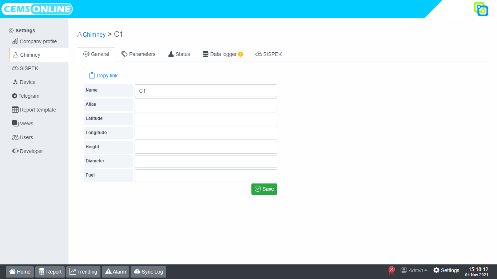

# Chimney

## Daftar Isi

[[TOC]]

## General
Digunakan untuk mengatur data chimney / cerobong.

* _Name_, nama cerobong.
* _Alias_
* _Latitude_, koordinat latitude cerobong.
* _Longitude_, koordinat longitude cerobong.
* _Height_, tinggi cerobong.
* _Diameter_, diameter cerobong.
* _Fuel_, nama bahan bakar yang digunakan.

## Status

## Data Logger

## SISPEK