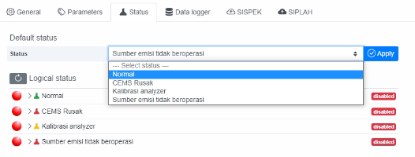
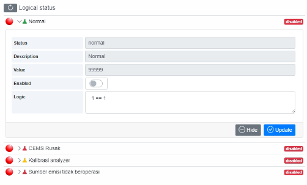
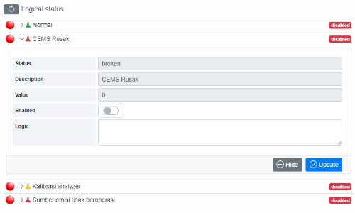
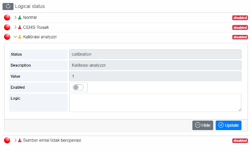
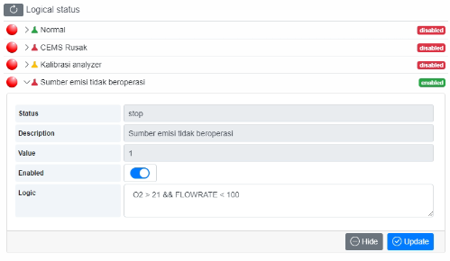

# Setting Status Chimney

Sesuai Permen LHK No. 13 tahun 2021, ada 4 kondisi laporan terkait Status Chimney :
1. **Normal** (mengirimkan sesuai nilai pengukuran ke SISPEK)
2.	**CEMS Rusak** (mengirimkan nilai “0” ke SISPEK)
3.	**Kalibrasi Analyzer** (mengirimkan nilai “1” ke SISPEK)
4.	**Sumber emisi tidak beroperasi** (mengirimkan nilai “1” ke SISPEK)

Fitur pengaturan Status Chimney di aplikasi CEMS Online Hawa dapat dilihat pada menu Settings -> Chimney `(login sebagai Admin)`

Pengaturan Status Chimney dapat dilakukan dengan 2 (dua) cara :
1. Secara manual ( memilih Default Status ) 
2. Secara otomatis dengan menerapkan logic untuk masing-masing Logical Status dan mengaktifkan logical status tersebut.

Jika menerapkan logic pada Logical status, urutan prioritas adalah sebagai berikut:
- Sumber emisi tidak beroperasi = Prioritas Tertinggi
- Kalibrasi Analyzer
- CEMS Rusak
- Normal
- Default Status  = Prioritas Terendah

Dengan urutan prioritas ini, jika logic pada **Sumber emisi tidak beroperasi** terpenuhi, maka otomatis status lain tidak akan terpengaruh lagi dan CEMS Online Hawa akan set nilai **`1`** untuk data 5 menit terakhir sejak logic tersebut terpenuhi. Berlaku untuk Logical status yang lainnya juga, jika Logical status diaktifkan _(enable)_.

Dalam kondisi Logical status ada yang aktif dan logicnya terpenuhi, maka apapun pilihan di Default status tidak akan pengaruh _(diabaikan)_.
Jika ingin menggunakan Default status, semua Logical status sebaiknya dinonaktifkan _(disable)_. Logical Status dapat digunakan jika Status tersebut dapat dikondisikan secara logic. 
Secara umum logic dapat berupa perbandingan parameter dengan nilai tertentu yang akan terpenuhi saat kondisi Status tersebut terjadi atau dapat juga dengan mengkondisikan nilai tertentu.
- Contoh kondisi Status Normal, dengan Logic terisi 1 == 1. Jika di-enable, maka status Normal ini akan selalu terpenuhi, karena Logic 1 == 1 akan selalu terpenuhi.

- Untuk kondisi CEMS Rusak perlu diketahui apakah ada parameter yang dapat mewakili kondisi tersebut.

- Untuk kondisi Kalibrasi Analyzer juga perlu diketahui apakah ada parameter yang dapat mewakili kondisi tersebut.

- Untuk Logic Status Sumber emisi tidak beroperasi, dapat dibuat dari parameter yang terkait dengan kondisi saat unit tidak beroperasi, misalnya dari kondisi parameter O2 dan FLOWRATE.

