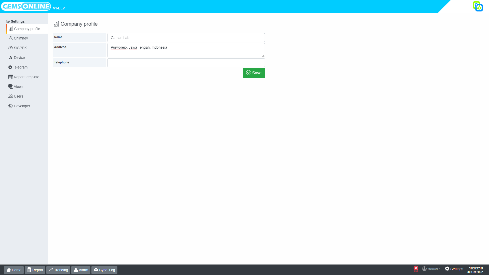

# Company Profile

Menu Company Profile ini digunakan untuk mengatur identitas perusahaan yang menggunakan aplikasi HAWA CEMS Online. Untuk dapat mengakses menu Company Profile anda harus login dengan pengguna yang memiliki role administrator. Setelah itu klik menu `Settings > Company Profile`.

Profil perusahaan ini harus diisi sesuai dengan kondisi aktual karena selain sebagai informasi user perusahaan, menu profil ini menjadi bagian untuk validasi lisensi dan dapat pula di gunakan sebagai template laporan.

Berikut kolom isian yang berada pada menu Company Profile.

| No  | Kolom     | Deskripsi                | Field pada template laporan |
| --- | --------- | ------------------------ | --------------------------- |
| 1   | Name      | Nama lengkap perusahaan  | company.name                |
| 2   | Address   | Alamat perusahaan        | company.address             |
| 3   | Telephone | Nomor telepon perusahaan | company.telephone           |
