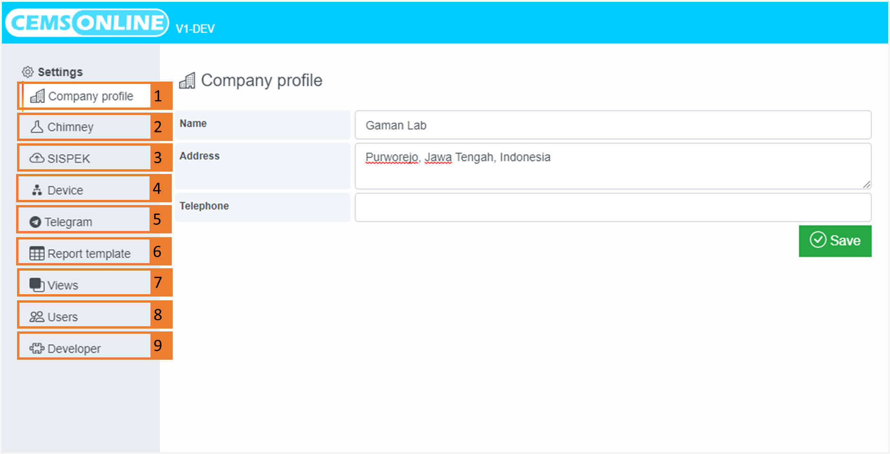

# Setting

Menu Settings merupakan menu yang berfungsi untuk melakukan pengaturan terkait penggunaan system aplikasi HAWA CEMS Online. Berikut penjelasan sekilas dari menu Settings:

|No.|Nama Menu|Penjelasan|
|---|---|---|
|1.|[Company profile](./company-profile/readme.md)  |Berisi mengenai profil Perusahaan yang menggunakan Aplikasi HAWA CEMS Online|
|2.|[Chimney](./chimney/readme.md)|Untuk melakukan pengaturan cerobong yang terdaftar pada aplikasi|
|3.|[SISPEK](./sispek/readme.md)|Untuk melakukan pengaturan server dan akun SISPEK|
|4.|[Device](./device/readme.md)|Pengaturan terhadap perangkat sumber data yang akan tersambung dengan aplikasi seperti analyzer, PLC, DAS, dll|
|5.|[Telegram](./telegram/readme.md)|Untuk mengatur fitur notifikasi aplikasi yang akan dikirimkan melalui aplikasi Telegram|
|6.|[Report template](./report-template/readme.md)|Untuk mengelola template report|
|7.| [Views](./views/readme.md)  |Untuk mengelola tampilan pada aplikasi yang berkaitan dengan visualisasi data secara realtime atau menggunakan custom query|
|8.|[Users](./users/readme.md)  |Untuk mengelola pengguna dan akses pengguna aplikasi|
|9.|[Developer](./developer/readme.md)|Untuk mengelola token yang digunakan untuk otentikasi API|

