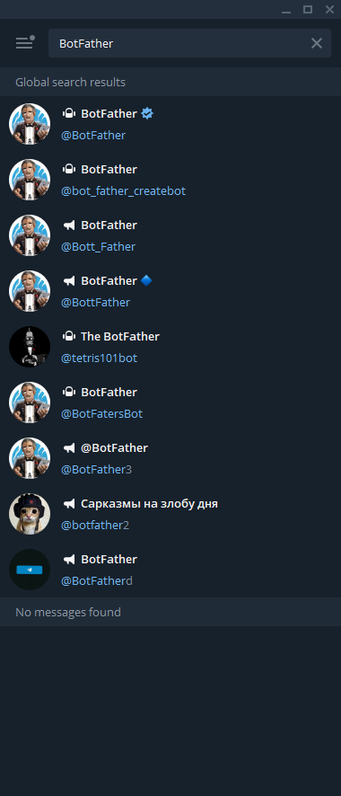
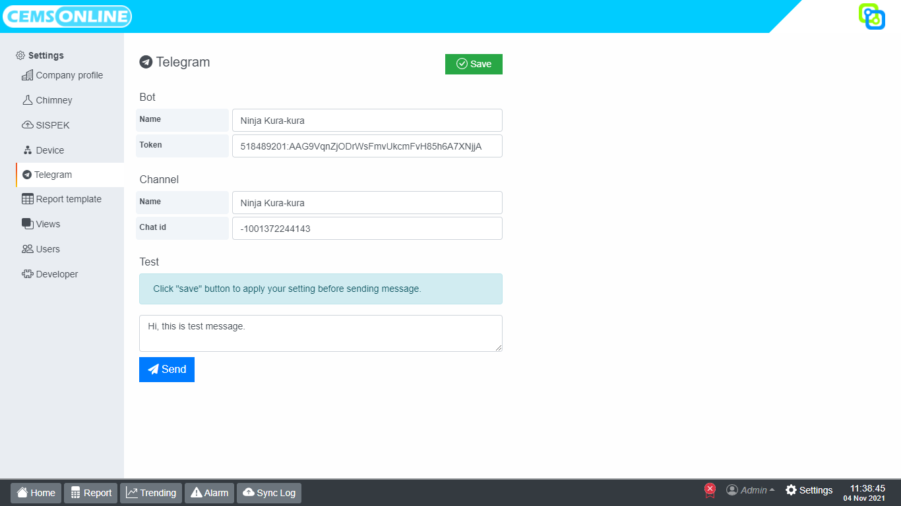

# Telegram

> Berfungsi untuk konfigurasi akun yang akan digunakan untuk mengirim notif atau pemberitahuan melalui Telegram dan channel yang akan menerima notif atau pemberitahuan.

## Daftar Isi

[[toc]]


## Persiapan

Hal-hal yang harus dipersiapkan agar fungsi ini bekerja adalah:

1. Bot Telegram.
2. Channel Telegram.

### Membuat Bot

Bot adalah sebuah akun virtual yang merupakan turunan dari akun nyata dan digunakan untuk keperluan otomasi fitur perpesanan pada Telegram.

1. Buka BotFather. Ketik Botfather di kotak pencarian Telegram Anda. Pilih pada ikon hasil pencarian yang terdapat centang biru.



2. Setelah botFather terbuka, aktifkan fitur interaksi dengan cara menekan tombol **START** yang terdapat pada bagian bawah.


3. Ketikkan perintah ```/newbot``` pada kolom chat untuk membuat bot baru, kemudian kirim chat.

4. Selanjutnya ketik nama bot untuk mempermudah identifikasi. Contoh: ```CEMS ONLINE```

5. Ketik nama pengguna untuk bot baru Anda. Nama pengguna bisa panjang antara 5-32 karakter tidak sensitif huruf besar. Sebagai aturan, nama pengguna harus diakhiri dengan sufiks *bot*.Contoh: ```cemsonline_bot```


6. Setelah selesai, Anda akan menerima token API, yaitu sesuatu seperti: *XXXXXX:YYYYYYYYYYYYYYYYYYYYYYYYYYYYYYYYYYYY*.

::: warning Perhatian
Catat dan simpan token tersebut karena nantinya harus kita input pada aplikasi Hawa.
:::

### Membuat Channel

Channel dalam Telegram bersifat seperti sebuah saluran untuk membagikan pesan kepada seluruh pengguna yang berlangganan channel tersebut.

> Setiap notif dari Hawa akan dikirim ke channel, sehingga setiap pengguna yang ingin menerima notif harus berlangganan pada channel tersebut.

Berikut ini langkah-langkah untuk membuat channel:

1. Pilih ikon pensil di sebelah kanan bawah.

2. Maka akan muncul tiga pilihan menu yang tersedia. Pilih Channel Baru untuk membuat channel.

3. Jika anda baru pertama kali ingin membuat channel baru, akan muncul tampilan seperti pada gambar. Pilih Buat Channel untuk melanjutkan.

4. Maka anda akan dihadapkan dengan form untuk membuat nama channel dan deskripsinya.  Jika anda sudah memiliki foto untuk profil channel yang anda buat, langsung tambahkan saja. Jika sudah, simpan dengan cara pilih Checklist di sebelah kanan atas.

5. Selanjutnya, anda akan dihadapkan pada tampilan seperti pada gambar. Set privasi channel sebabagai publik.

 ::: tip 
 Pada tahap ini, harus dibuat publik karena dibutuhkan untuk memperoleh *chat id* dari channel tersebut. Setelah kita memperoleh *chat id*, privasinya bisa diubah ke privat.
 :::


### Mendapatkan Chat Id

*Chat id* ini berfungsi seperti sebuah alamat dalam surat, sehingga Bot mengenali channel atau pengguna telegram berdasarkan *chat id*-nya.

Untuk mengetahui *chat id* dari channel yang telah kita buat sebelumnya, ikuti langkah-langkah berikut:

1. Tambahkan Bot yang telah kita buat sebagai admin channel.

2. Kirim chat unik ke dalam channel, contoh: `get_chat_id`.

3. Buka halaman web `https://api.telegram.org/botXXX:YYYY/getUpdates`, tetapi sebelumnya ganti karkter `XXX:YYYY` dengan token dari Bot yang kita buat sebelumnya.

4. Kemudian akan tampil text unik seperti:

::: tip Contoh respon
{"ok": true,"result": [{"update_id": 742880205,"channel_post": {"message_id": 9,"sender_chat": {"id": -1001682516792,"title": "Maswi","username": "maswi09","type": "channel"},"chat": {"id": -1001682516792,"title": "Maswi","username": "maswi09","type": "channel"},"date": 1635999393,"text": "Get_chat_id"}}]}
:::

5. Cari tulisan `"sender_chat": {"id": `, perhatikan setelah tulisan tersebut, dan angka itu merupakan bilangan negatif. Contoh: "sender_chat": {"id": **`-1001682516792`**

6. Catat angka tersebut lengkap dengan tanda negatifnya. Angka tersebut merupakan *chat id* dari channel yang kita buat.

::: warning CATATAN
Sampai pada tahap ini, kita sudah memiliki `token API` dan `Chat id`.

Catat untuk kita gunakan pada saat konfigurasi Hawa.
:::

## Konfigurasi Hawa

Langkah-langkah konfigurasi Telegram pada Hawa:

1. Pada hawa, buka menu `settings > Telegram`, maka pada Hawa akan tampil seperti:



2. Isi nama bot sesuai yang telah kita buat. 
3. Masukan token API dari Bot yang kita buat ke dalam kolom **Token**.
4. Isi nama channel sesuai yang telah kita buat.
5. Masukan **chat id** dari channel yang telah kita buat ke dalam kolom **Chat id**.
6. Klik tombol **Save** pada pojok kanan atas untuk menyimpan.
7. Test konfigurasi ini dengan cara klik tombol **Send** untuk mencoba mengirim pesan ke channel.
8. Periksa telegram anda, jika pesan berhasil terkirim ke dalam channel, maka konfigurasi telah berhasil.