# PT PJB UBJOM PAITON 9

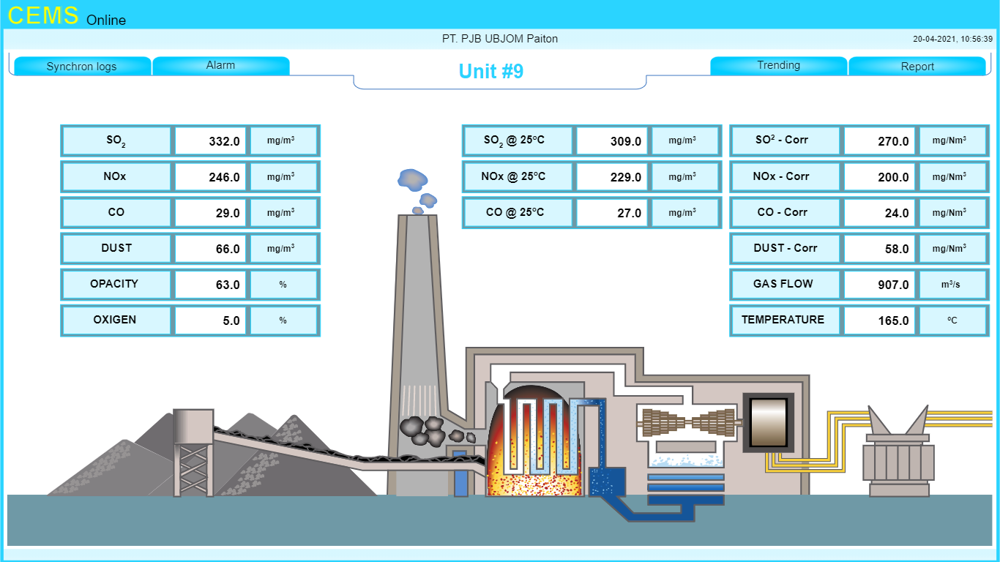

## Daftar Isi

[[toc]]

## Pengenalan Aplikasi

&nbsp;&nbsp;&nbsp;&nbsp;&nbsp;&nbsp;
Continuous Emission Monitoring System digunakan untuk memonitoring kadar buangan chimney secara realtime agar dapat mengendalikan pencemaran udara. Pengendalian pencemaran udara merupakan salah satu hal yang wajib dilakukan oleh industri sehingga pencemaran udara dapat terus dikurangi. Salah satu upaya dalam pengendalian pencemaran ini adalah dengan memantau kadar buangan melalui cerobong asap dari fasilitas industri. Continuous Emission Monitoring System digunakan untuk memantau kadar buangan dengan cara mengambil data dari pembacaan nilai analyzer dari PLC, lalu dikirimkan ke SIPLAH untuk dimonitor Kementrian Lingkungan Hidup & Kehutanan. Pada Continuous Emission Monitoring System webapps terdapat feature report untuk melaporkan kadar buangan dari cerobong asap yang dapat digunakan sebagai evaluasi.

## Mengakses Aplikasi

1.	Akses alamat Continuous Emission Monitoring System.
2.	Setelah aplikasi terbuka akan tampil halaman login. Pada halaman login ini menggunakan username / email dan password untuk mengakses aplikasi. 
Username dan password standar bawaan aplikasi adalah:

| Username | Password | 
|----------|----------|
|  admin   | admin123 |
| operator | operator |

### Home

&nbsp;&nbsp;&nbsp;&nbsp;&nbsp;&nbsp;
Setelah proses login selesai akan menampilkan halaman HOME yang menampilkan informasi parameter untuk monitoring secara realtime. Pada halaman HOME terdapat beberapa menu yaitu :
1.	Unit 9
Menu Unit 9 menampilkan parameter sebagai berikut :

 
### Alarm

&nbsp;&nbsp;&nbsp;&nbsp;&nbsp;&nbsp;
Halaman _“Alarm”_ berfungsi menampilkan realtime alarm dan history dari alarm. 

Hal yang diperlu diperhatikan saat akan menampilkan alarm :
- **Refresh**\
Berfungsi untuk memuat kembali halaman alarm yang telah ditampilkan. 
- **Filter**\
Menentukan rentang waktu history alarm yang ingin ditampilkan (Start time – End Time).
- **Ack**\
Berfungsi untuk mematikan alarm.
- **Export**\
Menyimpan data alarm dalam format excel.

 

### Historical Data

&nbsp;&nbsp;&nbsp;&nbsp;&nbsp;&nbsp;
Halaman _“Historical Data”_ menampilkan record pembacaan parameter setiap menit, yang dapat digunakan sebagai bahan evaluasi.

Beberapa yang perlu di perhatikan yaitu :
1. Memilih cerobong, pilih cerobong yang ingin di lihat recordnya pada _“Data logger”_.
2. Menentukan rentang waktu record yang ingin ditampilkan pada _“Time Range (From-To)”_.
3. Klik _“show”_ untuk menampilkan data record atau “export” untuk menyimpan sebagai excel.

 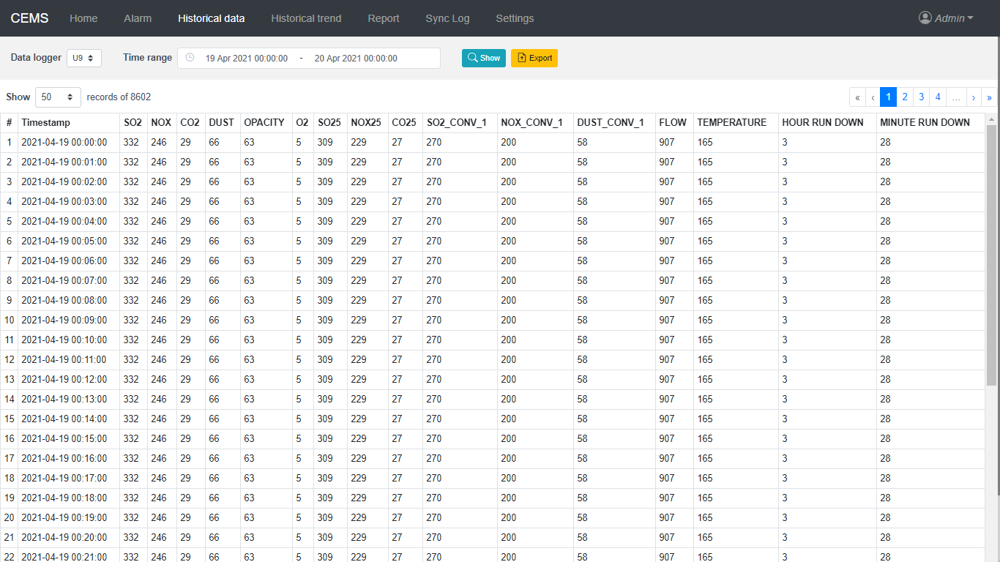
 
### Historical Trend

&nbsp;&nbsp;&nbsp;&nbsp;&nbsp;&nbsp;
Halaman _“Historical Trend”_ menampilkan historical data dalam bentuk grafik untuk mendapatkan trending data parameter yang dimonitoring. 
Beberapa yang perlu di perhatikan yaitu :
1. Memilih cerobong, pilih cerobong yang ingin di lihat recordnya pada _“Data logger”_.
2. Menentukan rentang waktu record yang ingin ditampilkan pada _“Time Range (From-To)”_.
3. Menentukan rata-rata tampilan pada pilihan _“Average”_.
4. Klik _“show”_ untuk menampilkan data record atau “print” untuk mencetak langsung.

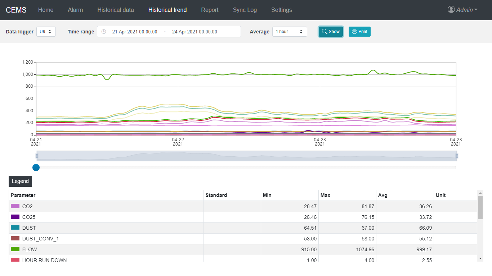 

### Report

&nbsp;&nbsp;&nbsp;&nbsp;&nbsp;&nbsp;
Halaman “Report” menampilkan informasi hasil rekap dari parameter monitoring Chimney dengan konsentrasi permenit.
Beberapa yang perlu di perhatikan yaitu :
1. Memilih cerobong, pilih cerobong yang akan dibuat laporannya pada pilihan _“Chimney”_.
2. Memilih jenis laporan, pilih jenis laporan yang akan dibuat pada pilihan _“Template”_.
3. Menentukan rentang waktu report yang ingin ditampilkan pada _“Time Range (From-To)”_.
4. Klik _“generate”_ untuk menampilkan report atau “save as excel” untuk menyimpan sebagai excel.

 

### Sync log

&nbsp;&nbsp;&nbsp;&nbsp;&nbsp;&nbsp;
Halaman _“Sync log”_ menampilkan riwayat dari sinkronisasi CEMS dengan SIPLAH. Pada menu ini, kita bisa melacak status pengiriman data ke SIPLAH sehingga jika terjadi kesalahan atau kegagalan bisa kita ketahui waktu dan penyebabnya.
Informasi yang dapat kita peroleh dari halaman ini diantaranya adalah :
1. _“Server”_ merupakan sistem yang menerima dan mengelola data hasil pemantauan emisi dari CEMS.
2 _“Chimney”_ merupakan nama cerobong dari data pengukuran yang dikirimkan ke SIPLAH.
3. _“Measurement time”_ menujukkan waktu pengukuran emisi, jika pada measurement time tertulis “20 Apr 2021 - 08.00”  itu berarti data yang dikirimkan adalah data pada tanggal 20 April tahun 2021 jam 08:00 sampai dengan jam 08:59.
4. _“Message”_, menunjukan status pengiriman, jika success berarti berhasil dan jika gagal akan ditunjukkan dengan status failed.

## Pengaturan Aplikasi

&nbsp;&nbsp;&nbsp;&nbsp;&nbsp;&nbsp;
Dalam menu settings terdapat beberapa submenu setting, diantaranya adalah :

### Company Profile
Mengatur data profil perusahaan. 
1. _“Name”_, nama perusahaan.
2. _“Address”_, alamat perusahaan.
3. _“Telephone”_, nomor telepon perusahaan.

Setelah mengisi data-data di atas, tekan tombol “save”.
 

### Settings SIPLAH
Memasukkan otentikasi ke SIPLAH dan untuk uji konektivitas dengan server.
1. _“Base Url”_, alamat server SIPLAH
2. _“API Key”_
Kedua data di atas diperoleh dari KLHK setelah perusahaan terdaftar untuk sinkronisasi data.

Setelah mengisi data, klik _“save”_.
 

**_“Chimneys”_** mengatur profil cerobong dan konfigurasi sinkronisasi dengan SIPLAH. 
Langkah – langkah setting chimney :
1. Pilih cerobong yang akan dikonfigurasi.

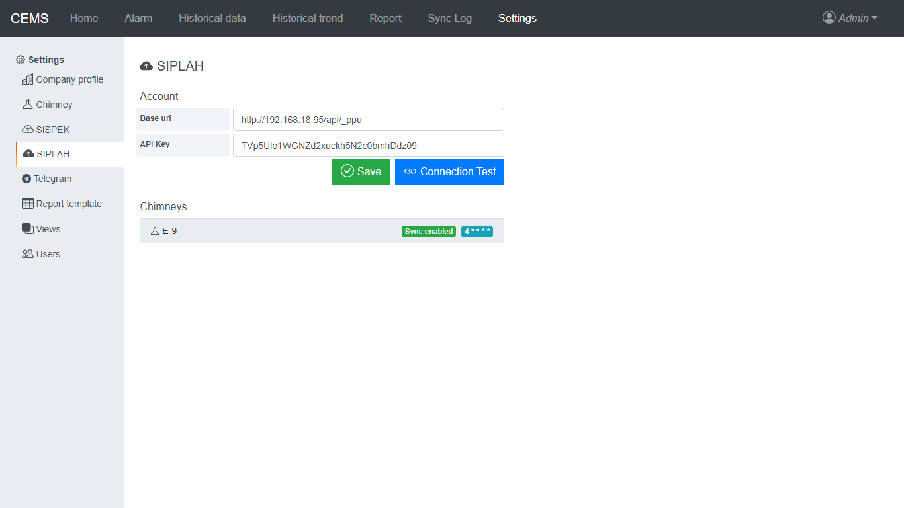
 
2. Setelah memilih cerobong, akan muncul form editor seperti berikut :

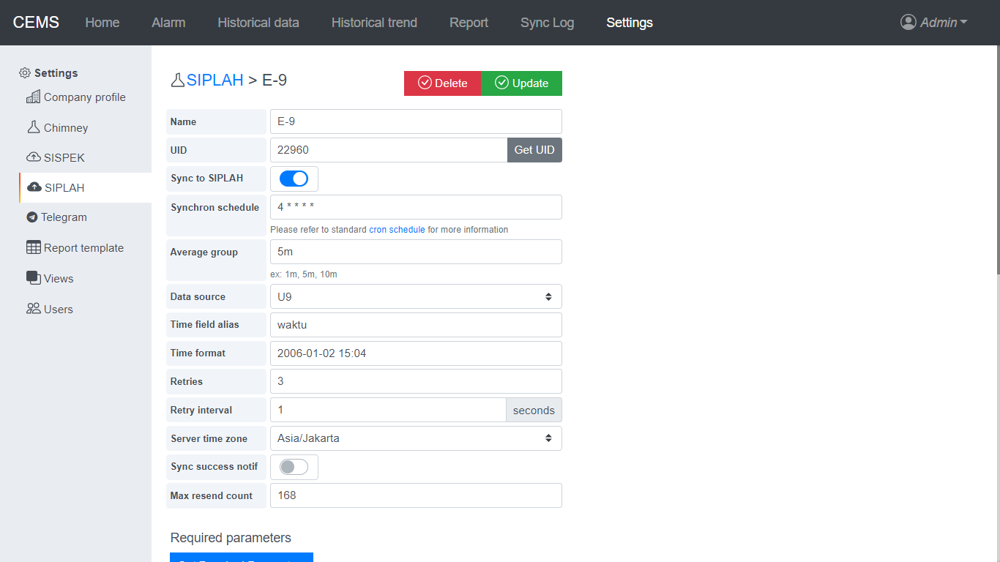

3. Isikan data sesuai dengan kondisi aktual 
- _“Name”_, nama cerobong.
- _“UID”_
- _“Sync to SIPLAH”_, aktifkan pengiriman data ke SIPLAH berdasarkan jadwal.
- _“Synchron Schedule”_, jadwal pengiriman data ke SIPLAH
- _“Average Group”_
- _“Data Source”_, nama cerobong
- _“Time field alias”_
- _“Time Format”_, format waktu yang digunakan
- _“Retries”_
- _“Retry Interval”_, interval percobaan pengiriman ulang data yang gagal.
- _“Server Time Zone”_, zona waktu yang di gunakan data yang dikirimkan. 
- _“Sync success notif”_, aktifkan notifikasi telegram setiap kali berhasil mengirimkan data ke SIPLAH.
- _“Max resend count”_, batas maksimal percobaan pengiriman. Jika batas ini tercapai, maka data tidak akan dikirimkan lagi walaupun belum berhasil.

a.	**SIPLAH Required Parameter**\
Digunakan untuk mendapatkan informasi dari SIPLAH mengenai parameter  yang wajib dikirimkan ke SIPLAH. Klik _“Get Required Parameters”_.

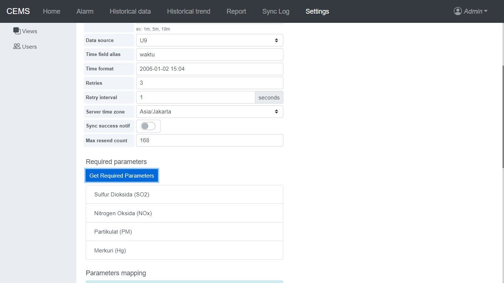

b.	**SIPLAH Parameters Map**\
Mapping parameter yang akan dikirimkan ke SIPLAH.

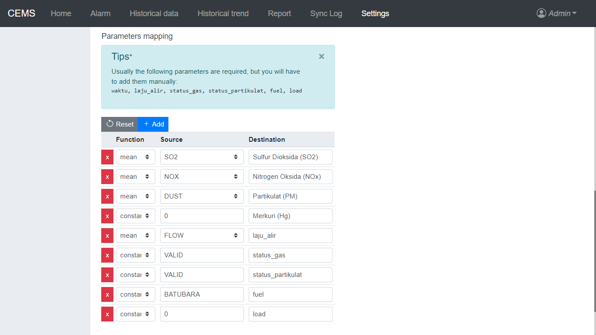 

- _“Reset”_, untuk menghapus seluruh parameter.
- _“Add”_, untuk menambahkan parameter.
- _“Function”_ 
- Kolom _“source”_, diisi dengan nama parameter pada logger dan metode perhitungan datanya.
- _“Destination”_, harus diisi sesuai dengan penamaan parameter pada SIPLAH.

c. **Submit data to SIPLAH**\
Digunakan untuk mencoba mengirimkan data ke SIPLAH, seperti menguji mapping data dan otentikasi ke SIPLAH. 
- Atur tanggal dan jam data yang akan dicoba untuk dikirim.
- Klik _“Submit”_, jika berhasil maka akan ada pesan success.	

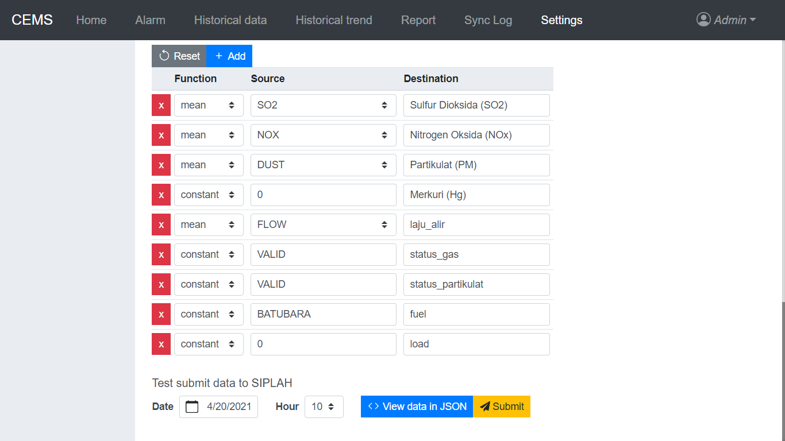

### Settings Telegram
1. Bot
- _“name”_ diisi dengan nama pengirim notification.
- _“token”_ diisi dengan token bot telegram.
2. Channel
- _“name”_ diisi dengan nama channel telegram.
- _“chat id”_ diisi dengan id channel telegram.

Klik _“save”_ untuk menyimpan dan isi kolom sending message lalu klik tombol “send” untuk tes kirim notifikasi.

### Settings Report Template
Mengatur format report sesuai dengan kebutuhan user. 

1. Pilih template yang sudah ada atau klik _“create”_ untuk membuat template baru.

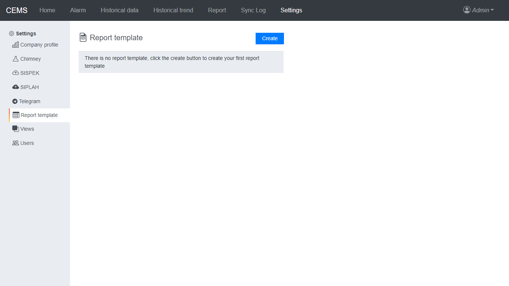

### Settings Users
Mengubah atau menambahkan user yang dapat membuka aplikasi.

1. Pilih user yang sudah ada atau klik “New user” untuk membuat user baru.

 
2. Isikan data pada kolom yang tersedia.

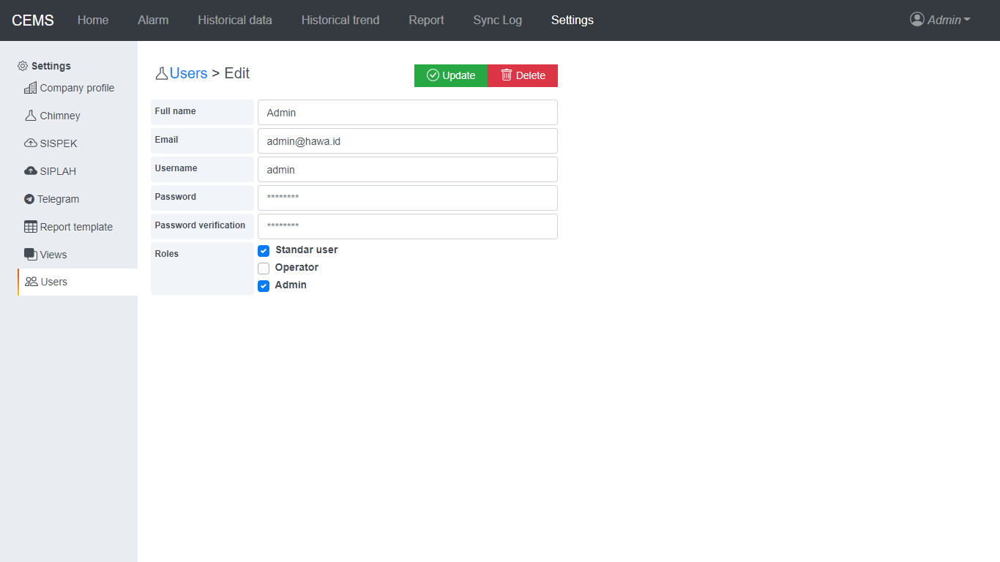

- _“Full name”_, nama lengkap.
- _“Email”_, alamat email.
- _“Username”_, nama yang digunakan untuk login.
- _“Password”_, password yang digunakan untuk login.
- _“Password verification”_, pengulangan password.
- _“Roles”_, menentukan wewenang user.
 
### Logout

&nbsp;&nbsp;&nbsp;&nbsp;&nbsp;&nbsp;
Proses keluar dari aplikasi Continuous Emission Monitoring System dengan cara menekan icon user pada sebelah kanan kemudian menekan tombol logout maka akan menampilkan halaman login yang berarti telah keluar dari aplikasi.

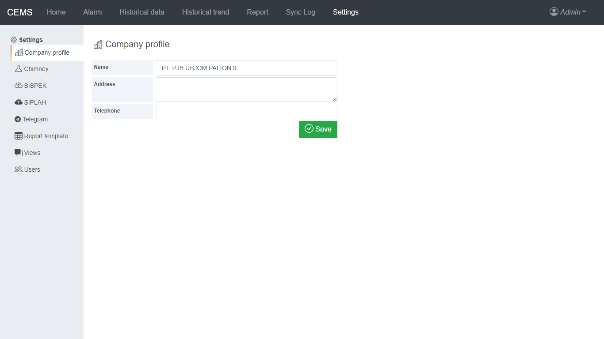

